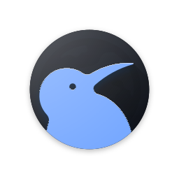

<p align="center">
  
</p>

<h1 align="center">Cobalt</h1>

<p align="center">
  A revival of <a href="https://github.com/kiwibrowser">Kiwi Browser</a> for Android.
</p>

<p align="center">
  <em>The mark is inspired by Kiwi Browser's own, and inverted — a blue bird on a
  dark ground where the original is a white bird on a coloured one. The silhouette
  carries the lineage; the inversion says this is a separate project, not something
  Kiwi ships. Derived from <code>kiwi_logo_circle.svg</code>, Copyright &copy; 2022
  Geometry OU (Kiwi Browser), BSD 3-Clause. Neither the Kiwi Browser name nor
  Geometry OU endorses Cobalt.</em>
</p>

---

Kiwi is a Chromium fork whose defining feature — desktop-class extension support on
mobile — has gone unmaintained. Cobalt picks the project up, carries its patches
forward onto a current Chromium, and ships it under its own identity.

It is three things at once, and the distinction between them is the whole design:

| | What | Why |
|---|---|---|
| **Fork** | The engine tree — Blink, V8, the network stack, the extension system | Inherited whole from Chromium via Kiwi. Untouched except where a patch demands it. |
| **Port** | Kiwi's patch set, carried onto a current Chromium; the build, identity, and signing moved to ours | Kiwi is years behind upstream. Closing that gap, repeatably, is the actual work. |
| **Rewrite** | The Android shell above the engine — UI, address bar, tabs, settings | Written fresh in Kotlin and Compose rather than inherited from Kiwi's Java. This is the part we own. |

**App ID:** `app.auriel.cobalt` · **Repository:** <https://github.com/AurielSolaris/Cobalt>


## Status

Stage 3 complete. Chromium 140 builds from source and produces a working APK,
verified on device — see [`docs/gate-a-results.md`](docs/gate-a-results.md).
Kiwi's patches are triaged and measured but not yet ported; that is Stage 5.

---

### Extensions: both MV2 and MV3

Cobalt supports **Manifest V2 alongside Manifest V3, and will not drop MV2**.

MV2 is the only manifest version that grants `webRequestBlocking` — a blocking,
full-context view of network requests. MV3 replaces it with `declarativeNetRequest`,
a static rule list, which is strictly less capable. Content blockers and anything
that needs to reason about a request before it leaves the device work properly only
under MV2.

Extension support on mobile was Kiwi's reason for existing. Shipping it with the
more capable half removed would be a downgrade wearing a revival's clothes.
See [decision 0005](docs/decisions/0005-support-mv2-and-mv3.md).

---

## Where the line is

The engine is forked, never rewritten. Blink renders the pages, V8 runs the
JavaScript, and Chromium's network stack fetches the bytes — we do not reimplement any
of it, and patches that try will be declined regardless of quality.

Everything above the engine is fair game to rewrite, and the shell largely is one.

The JavaScript engine is **not** being replaced. A JavaScriptCore backend is parked as
a post-1.0 experiment behind a build flag that is off by default; see Stage 12 of the
project plan. The engine interface in `:modules:core` is kept engine-neutral so that
experiment stays possible, and for no other reason.

## Status

Pre-alpha. **Milestone 0.1.0 works**: type an address, and the page is fetched, parsed,
and rendered on device. Links navigate. Tabs and incognito tabs work.

What is real today:

- Address bar with URL normalization — a bare host always becomes `https`, never `http`
- Fetching over http(s) with redirects, charset detection, and typed, readable errors
- A tolerant HTML parser that never throws on malformed markup
- A renderer covering headings, paragraphs, inline emphasis, links, lists, `<pre>`,
  block quotes, rules, and image alt text
- In-memory tabs, a tab switcher, and incognito tabs
- One Dark interface, blue accent, near-square corners

What is deliberately not there yet: CSS, JavaScript execution, images, history,
bookmarks, downloads, and extensions. The renderer is a bring-up shim with a scheduled
deletion date — Blink replaces it in Stage 6, once the Chromium tree builds.

The roadmap is in [`docs/roadmap.md`](docs/roadmap.md); design and engine decisions,
including the ones that were rejected, are in [`docs/decisions/`](docs/decisions).

## Built for 4 GB and 2 cores

That is the target device, not the floor. Chromium's defaults assume far more
headroom than a budget Android phone has, and at this size memory is the binding
constraint rather than CPU — so background tabs are evicted by design, and the
process model is a tuning decision rather than an inherited default.

Memory saving and prerendering are **settings**, not silent policy. Both trade
something you can feel — a reload when you return to a tab, data and battery spent
on a guess — so both say what they cost and let you choose.

## Modules

| Module | Contents |
|---|---|
| `:modules:core` | URL handling, HTTP fetching, text decoding, the JS engine interface |
| `:modules:engine` | HTML tokenizer and tree builder, the stub JS engine |
| `:modules:app` | Android Compose shell — chrome, tabs, address bar, renderer |

## Building

```sh
./gradlew :modules:app:assembleDebug
./gradlew check
```

Requires JDK 17 and the Android SDK (compileSdk 35). Point `local.properties` at your
SDK with `sdk.dir=...`. Full instructions, including the Chromium build environment
needed from Stage 3 onward, are in [`docs/build.md`](docs/build.md).

## Interface

One Dark, blue accent, near-square corners. Three bundled variable fonts: Open Sans for
the interface, EB Garamond for display text and document headings, JetBrains Mono for
code. A bottom bar carries Home, Extensions, Tabs, and Downloads; bookmarks and settings
sit in the address bar's overflow menu.

There is no shortcut grid and no trending-searches feed on the new-tab page, and there
will not be one. Both are advertising surfaces. When Cobalt has browsing history to draw
on, that page can show your own most-visited sites — earned, not sold.

## Branches

`nightly` is the integration line and everything lands there first; `stable` is the
release line and only ever receives merges from `nightly`.

From 0.2.0 to 1.0.0 every milestone also keeps a `nightly-0.x.0` and a
`stable-0.x.0`, and those are never deleted. The risk in this project is
concentrated in a few very large steps, and when one of them goes wrong a tag is a
point whereas a branch is somewhere a fix can actually land. See
[`docs/branching.md`](docs/branching.md).

## Licensing

Cobalt is free software under the **GNU General Public License, version 3**
([`LICENSE`](LICENSE)).

That licence applies on top of, and does not replace, the licences of the upstream
projects Cobalt is built from. Chromium, Blink, and V8 remain BSD-3-Clause; Kiwi
Browser keeps its own terms. Those notices are reproduced in full in
[`NOTICE`](NOTICE), and redistributing Cobalt means honouring all of them together.

## Contact

Debaditya Malakar — <debadityamalakar@gmail.com>
