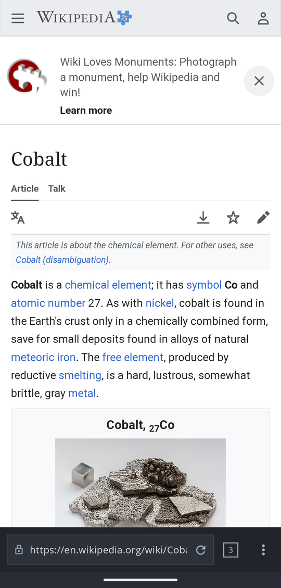
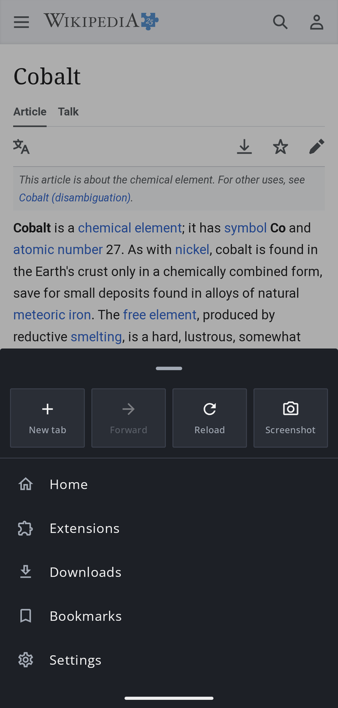
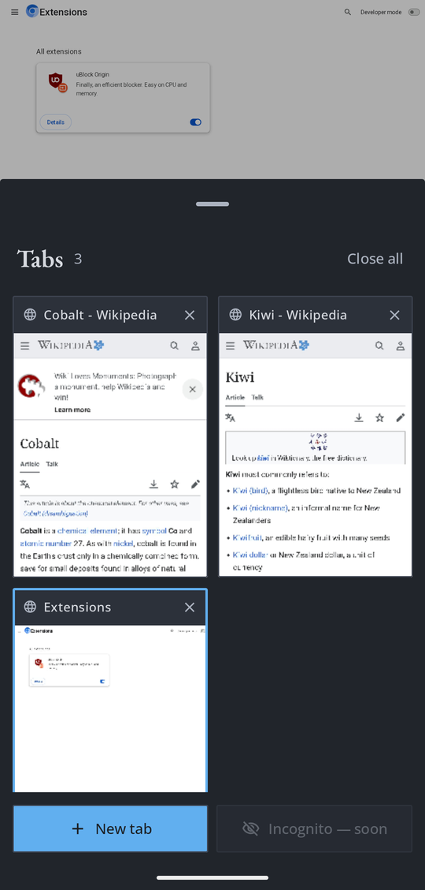
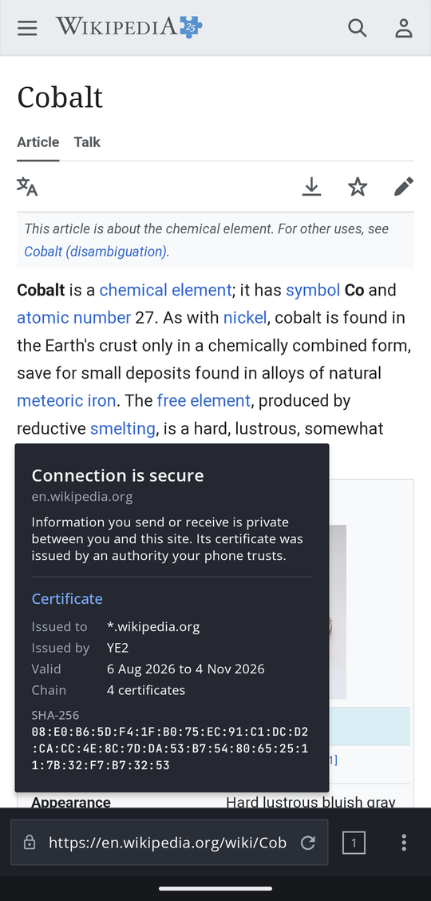
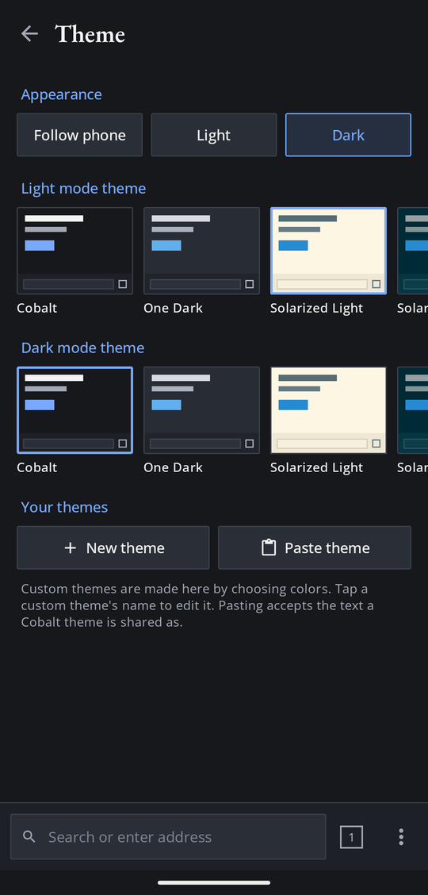
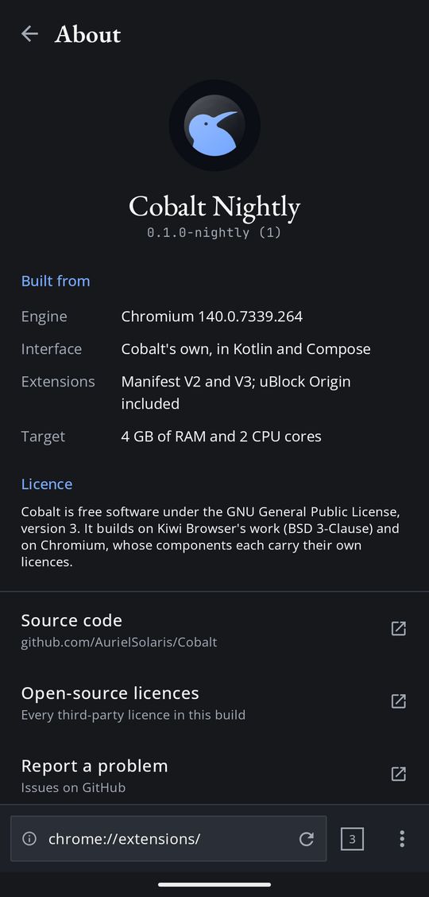
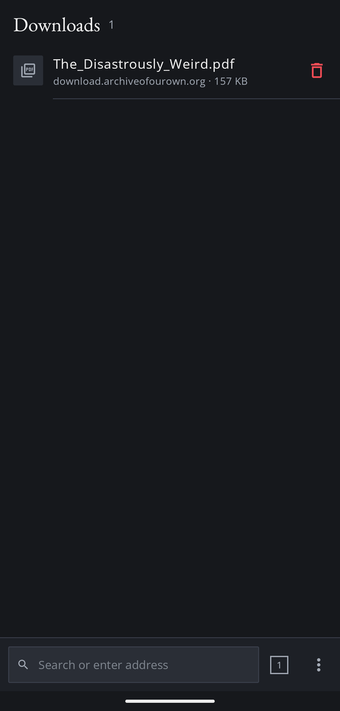
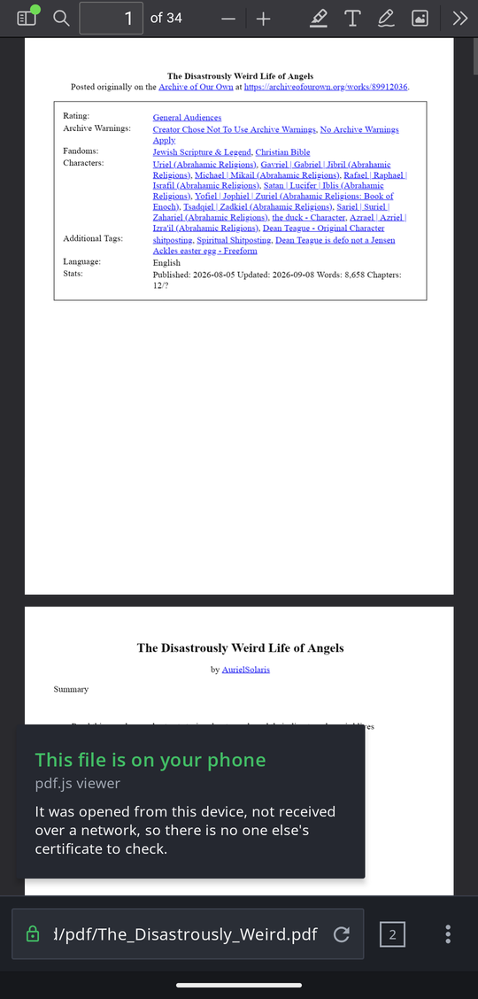

# Joining Cobalt's shell to the content layer

Release gate 3, and the largest remaining piece. What the shell *looks like* was
settled long ago — [0002](decisions/0002-shell-design.md) and
[0007](decisions/0007-user-themes.md) cover palette, shape, fonts and the four
bottom sections. This is about the seam: how a Compose UI drives Chromium.

**Status: gate 3's viability is proven end to end — Chromium renders a page inside Cobalt's Compose app.** The interface itself is not built. The point of
writing it now is that the two questions that could have changed the plan are
both answered, and they came back favourably.

## The two viability questions, both closed

### 1. Does `chrome://extensions` need `chrome/android`? — No

```
$ gn path out/Default //chrome/browser/ui:ui //chrome/android:chrome_java
No non-data paths found between these two targets.
```

Asked by [0014](decisions/0014-gms-removal-before-shell.md), which called it the
shell's one genuine viability risk. The extension UI is a WebUI page built under
`enable_extensions_core`; all the shell must do is navigate a tab to it.

### 2. Can an embedder host content without `chrome/android`? — Yes

```
$ gn path out/Default //content/shell/android:content_shell_java \
                      //chrome/android:chrome_java
No non-data paths found between these two targets.
```

And the embedder is **three Java files**:

```
content/shell/android/java/src/org/chromium/content_shell/
    Shell.java                    446 lines
    ShellManager.java             150 lines
    ShellViewAndroidDelegate.java
```

That is the whole reference implementation of "host Chromium in an Android
view". `chrome/android` is Chrome's *product*, not the embedding requirement.

## The seam, concretely

Everything needed comes from `//content/public/android` and
`//components/embedder_support/android` — both already in `chrome_public_apk`'s
graph (98 edges), so nothing new has to be enabled.

| Piece | What it is | Cobalt's use |
|---|---|---|
| `BrowserStartupController` | `startBrowserProcessesAsync(...)` | start the browser process from Cobalt's Application/Activity |
| `WindowAndroid` | binds native to the Activity | one per Activity |
| `ContentViewRenderView` | the compositor surface, an Android `View` | wrapped in a Compose `AndroidView` |
| `ContentView` | input and accessibility over a `WebContents` | per tab |
| `WebContents` | **the tab** | one per Cobalt tab |
| `NavigationController` | back/forward/load | drives the address bar and gestures |
| `ViewAndroidDelegate` | glue for anchored views | Cobalt's own implementation |

**Cobalt owns its tab model.** Chrome's `Tab`, `TabModel` and `TabModelSelector`
live in `chrome/android` and are not required: a tab is a `WebContents` plus
Cobalt's own state. That is a Kotlin data structure
([0009](decisions/0009-kotlin-for-new-code.md) — new code is Kotlin), not a port
of Chrome's.

This is also where the deliberately-guarded region from the webNavigation port
finally connects. `WebNavigationEventRouter` is compiled out on Android, so
`onTabReplaced` and `onCreatedNavigationTarget` do not fire; when Cobalt has a
tab model, that guard is where it hooks in. See
[`ublock-bundling.md`](ublock-bundling.md).

## The architecture this actually implies — and it inverts the obvious one

The obvious plan is "write Cobalt's Compose shell inside Chromium's build,
next to `chrome_java`". **That does not work**, and it is better to know now:

- Chromium **ships** the Compose runtime — `third_party/androidx` carries
  `androidx_compose_runtime`, `_ui`, `_foundation`, `_animation` and
  `_material3`, 227 references in one BUILD.gn.
- Chromium **cannot compile** Compose source. `@Composable` requires the Compose
  Kotlin compiler plugin, and `build/android/gyp/kotlinc.py` has no plugin
  support at all — no `-Xplugin`, nothing. Nothing in the tree uses Compose
  today; the libraries are transitive baggage.

So the dependency runs the other way round. Chromium's own build has the
template for it:

```
build/config/android/rules.gni:1687   template("dist_aar")
chromecast/BUILD.gn:717               dist_aar("cast_browser_dist_aar")
```

`dist_aar` packages Java, **native libraries**, assets, resources and a manifest
into an `.aar`. So:

**Chromium's content layer is exported as an AAR, and Cobalt's existing Gradle
app consumes it.** The Compose interface stays where Compose already works —
`modules/app`, which has Material3, the theme, and the screens from 0.1.0 — and
Chromium becomes a dependency of Cobalt rather than Cobalt becoming a patch to
Chromium.

That is also better for every reason
[`gms-removal.md`](gms-removal.md) already argues: the shell is Cobalt-owned code
in Cobalt-owned files, and it never conflicts on rebase.

### Verified: the AAR builds, and the seam is in the right place

`tools/patches/cobalt-content-aar.py` adds `dist_aar("cobalt_content_dist_aar")`
over exactly the embedding surface above — `content_full_java` plus
`embedder_support:content_view_java`. It built in **21 seconds, 2 steps**, over
Java that was already compiled.

| | |
|---|---:|
| `cobalt_content.aar` | **55.3 MB** (58,031,439 bytes) |
| files | 1,567 |
| classes in `classes.jar` | **22,364** |
| **`org/chromium/chrome/` classes** | **0** |

That last row is the result that matters. **Nothing from `chrome/android` comes
along** — no Chrome UI, no tab model, no toolbar. The closure is the content
layer and its dependencies:

```
5489  org/chromium/blink      (mojom bindings, the bulk of it)
2165  org/chromium/network
1931  com/google/common
1446  org/chromium/media
1039  org/chromium/device
 509  org/chromium/ui
 433  org/chromium/content
 414  org/chromium/base
```

So the seam is cut in the right place: Cobalt gets the engine without inheriting
Chrome's interface, which is the whole premise of gate 3.

**55 MB of Java is not the shipped cost.** Most of those 5,489 blink mojom
classes are unreachable from any given embedder and R8 in the consuming app
shrinks accordingly — but that is an expectation, not a measurement, and it
should be measured once the app actually links against it.

### Then the native library, and one thing that does not work

Adding `native_libraries = [ "$root_build_dir/libchrome.so" ]` takes the
artifact from 55.3 MB to **260.3 MB**, in 24 seconds. `jni/arm64-v8a/libchrome.so`
is in it, all 205 MB.

**Assets do not come through, and cannot.** Adding
`chrome_apk_pak_assets`, `chrome_apk_locale_pak_assets` and
`chrome_public_non_pak_assets` to `deps` builds them and then discards them —
measured, `assets/` count **zero**. The reason is in
`build/android/gyp/dist_aar.py`, which takes

```
--jars  --dependencies-res-zips  --r-text-files
--proguard-configs  --native-libraries  --abi
```

and **has no assets argument of any kind**. The template's doc comment lists
`assets/` because that is what an `.aar` may contain in general, not because
this template writes any.

So the `.pak` bundles, ICU data and the bundled uBlock Origin CRX have to reach
the app by another route. Cheapest is copying them out of the Chromium build
into `modules/app/src/main/assets/` as a build step — no Chromium patch, and
the paths the engine looks for are unchanged. Patching `dist_aar.py` to support
assets would be tidier and is a change to a shared script for one consumer's
benefit.

### The mismatch I predicted, the fix I built, and why both were wrong

`libchrome.so` is built for `chrome_public_apk` and its JNI registration is
generated from *that* APK's Java — `chrome/android`'s, which this AAR does not
carry. That looked like a startup failure waiting to happen, and the fix looked
obvious: give Cobalt its own `shared_library` whose registration comes from the
Java Cobalt actually ships.

**It was built. It achieves nothing.**

`chrome_common_shared_library("libcobalt")` with
`java_targets = [ "//chrome/android:cobalt_content_dist_aar" ]` is valid GN,
links a 205 MB `libcobalt.so` in 46 seconds, and produces:

```
libcobalt__jni_registration.srcjar   642860 bytes   md5 1dbf7ae576d3...
libchrome__jni_registration.srcjar   642860 bytes   md5 1dbf7ae576d3...
```

**Byte-identical.** Pointing `java_targets` at the AAR changed no part of the
generated registration, because a shared library's JNI surface is decided by the
C++ it contains, not by the Java it is told about. Cobalt wants Chrome's browser
layer — extensions live there, and extensions are why Cobalt exists — so it
necessarily wants Chrome's JNI surface. There is no version of "Chrome's browser
layer with content's JNI".

And that undermines the problem as well as the fix. `third_party/jni_zero/jni_zero.gni:597`
defaults to:

```gn
add_stubs_for_missing_jni = true
remove_uncalled_jni = true
```

So a registration **already** tolerates Java that is not present: missing
implementations become stubs and uncalled natives are dropped. The startup
failure predicted here may simply not occur.

**Both the fix and the problem are now unproven, and only one test settles
either:** load the library from the Gradle app and call
`BrowserStartupController`. Until that runs, "the AAR needs Chrome's Java" is a
guess in both directions.

`libcobalt` was removed rather than kept — it doubled a 205 MB link for no
measured benefit. If the startup test does find a real mismatch, that target is
where the fix goes, and it is in git history.

"Just use content_shell's library" remains unavailable for the reason above:
Cobalt needs Chrome's browser layer, not bare content.

## Closed: Compose draws over the content surface

The riskiest unknown, and it is answered.

`ContentViewRenderView` composites into a `SurfaceView`, which SurfaceFlinger
composites rather than the view hierarchy — so "does Compose draw on top" is not
answerable from Compose's painting rules. If it did not, Cobalt's entire
interface would need a different structure.

`modules/app/.../content/ContentSurface.kt` hosts a real `SurfaceView` in an
`AndroidView`, painted through its holder with `lockCanvas` so the pixels come
from the surface rather than from Compose. `ContentSurfaceSpike.kt` puts Compose
chrome above and below it and offers a switch on `setZOrderOnTop`.

| `setZOrderOnTop` | Result |
|---|---|
| `false` (default) | **Compose chrome draws over the surface** — address bar and bottom bar both visible |
| `true` | **all Compose chrome disappears** behind the surface |

Verified on device, both states, screenshots taken. The negative control is what
makes it conclusive: the difference is entirely `setZOrderOnTop`, and the
default is the one Cobalt needs. `ContentViewRenderView` defaults to `false` for
the same reason, so this is the supported direction rather than a lucky accident.

Kept as a runnable screen rather than deleted — it is the regression test for
the seam. When `ContentViewRenderView` replaces the placeholder, the screen
should behave identically.

## The app consuming the AAR — and the mismatch, confirmed

`tools/build/export-aar.sh` copies the artifacts out of the WSL checkout into
the Gradle project. Both destinations are gitignored: a 250 MB AAR and 70 MB of
assets do not belong in a repository and rebuild in a minute.

Getting Gradle to accept it took four fixes, each a real incompatibility rather
than a configuration nicety:

| Symptom | Cause | Fix |
|---|---|---|
| `Duplicate class _COROUTINE...`, `androidx...` | the AAR carries its whole closure | `jar_excluded_patterns` for androidx, kotlin, kotlinx |
| `Duplicate class ...ListenableFuture` | androidx pulls the empty `listenablefuture` stub; the AAR has real Guava | exclude the stub in Gradle |
| `AAPT: res/0_res/anim: resource file cannot be a directory` | `dist_aar` writes `res/<n>_res/…`, which is not an AAR layout | `flatten-aar-res.py`, which refuses if there is ever more than one index |
| duplicate `attr/elevation` *inside* the AAR | androidx resources travel even with androidx classes excluded | excluding them was **wrong** and is undone; see "The resources have to come" below |

Result: a **257.8 MB APK** built by Gradle from Compose source, carrying
`libchrome.so` uncompressed and 341 assets.

### Two classes the AAR can never carry

`org.chromium.build.BuildConfig` and `org.chromium.build.NativeLibraries` are
generated by the `android_apk` template, not by any library — everything in them
describes an APK. A `dist_aar` produces neither, and Chromium's base fails at
the first call with `NoClassDefFoundError`. Cobalt declares both itself, in
`modules/app/src/main/java/org/chromium/build/`, which is the right home: the
Gradle app *is* the APK. A search of the whole `gen` tree finds only these two.

`BuildConfig.IS_DESKTOP_ANDROID` must stay `true` — the AAR's Java was compiled
from a tree built that way, and it is what gives Cobalt extensions at all. The
app's `minSdk` moved from 24 to **29**, Chromium's floor.

### The JNI mismatch is real after all

With both classes present, `libchrome.so` loads and the process aborts:

```
java.lang.AssertionError: JNI multiplexing hash lookup failed with J.N
    at org.jni_zero.JniInit.crashIfMultiplexingMisaligned(JniInit.java:46)
```

**So the mismatch predicted two steps ago exists, and the revision that talked
it away was wrong.** `add_stubs_for_missing_jni` does not save you: JNI
multiplexing hashes the *whole* surface and dispatches through a generated `J.N`
class, so the app's `J.N` — generated from the AAR's Java — cannot agree with a
native table generated from `chrome_public_apk`'s.

It also explains why `libcobalt` produced a byte-identical registration and
fixed nothing: the multiplexing table is not what `java_targets` controls.

The actual lever is a GN argument, `enable_jni_multiplexing`, now `false` in
`args.gn`. Without multiplexing, registration is by name and jni_zero's
defaults handle the rest. **`chromecast` sets it false too — and chromecast is
the one build in the tree that ships a `dist_aar`.** The two go together, and
that is not a coincidence.

Cost: multiplexing exists to shrink the JNI table, so this gives up binary size.
Unmeasured, and worth measuring once the shell runs.

## Closed: the page renders

**Chromium's browser process starts from Cobalt's Gradle app, and a
`WebContents` draws a real website into a Compose window.** That was the last
viability question in this document, and it is answered by
`content/ChromiumPageActivity.kt` rather than by an argument.

Getting there was seven distinct failures, and none of them was the one this
document spent its length worrying about. They are listed because each is a
property of embedding Chromium that no amount of `gn path` would have found.

| Failure | What it actually was |
|---|---|
| `NoClassDefFoundError: org/chromium/ui/R$integer` | `dist_aar` strips every generated `R`, and Chromium has ~160 of them, one per `resource_package` |
| `Check failed: !actual_locale.empty()` | `ResourceBundle.setAvailablePakLocales` was never called; Chrome passes generated `ProductConfig.LOCALES`, which is per-APK |
| `Failed to find class DataSharingNetworkLoaderImpl`, then SIGTRAP | the AAR depended on `chrome_java`; the APK depends on the `chrome_all_java` group |
| `ClassNotFoundException: androidx.appcompat.app.AppCompatActivity` | `ChromeActivity` extends it, and the AAR excludes androidx |
| `GooglePlayServicesMissingManifestValueException` | `GoogleApiAvailability` validates *your* manifest before answering, so asking it whether GMS exists throws |
| `PackageManager$NameNotFoundException: SandboxedProcessService0` | child processes are Services and a manifest must declare all 50 |
| `NoSuchMethodError: ...ContentViewRenderView_init in GEN_JNI` | the registration srcjar had not been rebuilt |

### The resources have to come, and the duplicates are merged on the way out

Excluding the AAR's resources moved the failure from build time to runtime,
where it is worse: Chromium's Java references its own `R` classes.

So they travel, and `tools/build/flatten-aar-res.py` resolves the duplicates.
It grew four rules, each from a failure:

- **The prefix is `res/<n>_<name>/`**, not `res/<n>_res/`. Cobalt's AAR has nine
  such directories. The old guard — refuse more than one index — was a proxy for
  the real question and answered it wrongly; it now checks for a **path
  collision** directly, and there are none.
- **A top-level `<attr>` and one nested in a `<declare-styleable>` define the
  same resource**, and AGP counts both.
- **`<declare-styleable>` is unioned, not deduplicated.** AppCompat and Material
  both declare `SearchView` with different contents; keeping the first deleted
  `queryBackground`, `searchIcon` and the rest while leaving the styles that
  reference them.
- **`R.txt` needs the same treatment**, and a symbol it marks `0x0` is
  undefined — a resource this build does not ship.

### The R classes are regenerated as forwarders

`tools/build/generate-chromium-r.py` reads the AAR's 36,000 class constant pools
for `R$type` field references and writes one `R` per package, every field
forwarding to the app's `R`:

    public static final int min_screen_width_bucket =
        app.auriel.cobalt.R.integer.min_screen_width_bucket;

160 classes, 10,626 fields. Shipping Chromium's own would have compiled and then
returned ids from the wrong aapt2 link. This needs
`android.nonTransitiveRClass=false`.

### ContentViewRenderView had to be put into the build

The `View` a `WebContents` composites into is Chromium's own, in
`//components/embedder_support/android` — and **Chrome does not use it**, so
neither half was in `chrome_public_apk`'s graph:

    $ strings out/Default/libchrome.so | grep -c ContentViewRenderView
    0

`cobalt-content-view-render-view.py` adds the Java to `chrome_all_java` and the
C++ to `libchrome`. Both, and in those specific places: `GEN_JNI` is generated
from `java_targets = [ "//chrome/android:chrome_public_apk" ]`, so Java outside
that graph gets no registration however the AAR is built.

### Two things that are easy to get wrong again

**The JNI registration is not rebuilt by building the AAR.** Only
`chrome_public_apk` depends on it, so adding Java that declares native methods
leaves the srcjar stale and the mismatch is invisible until the method is
called. `export-aar.sh` now refuses when it is older than `libchrome.so`.

**`ApplicationStatus.initialize` must run in `Application.onCreate`**, because
the lifecycle listener it registers only sees Activities created afterwards —
`Found untracked Activity` — and it asserts if called twice.

## Closed: the shell runs on Chromium

<p>
  
  
  
</p>

`MainActivity` now runs Cobalt's own Compose interface over Chromium. The
pieces:

| Piece | What it does |
|---|---|
| `browser/engine/ShellEngine.kt` | The Activity-level half of the seam: start-up status, the page surface, capabilities (incognito, extensions URL), page capture. `ShellEngines.create` finds `ChromiumShellEngine` by name and falls back to the document engine, because `content/` is not compiled without the AAR. |
| `browser/BrowserController.kt` | Replaces `BrowserViewModel`. Drives the screens from `TabModel`; owned by the Activity, because every session is bound to its window. |
| `browser/BrowserApp.kt` | The page, then one toolbar. The page surface is composed **once**; home and placeholder sections are drawn over it, never instead of it. |
| `browser/BrowserSheets.kt` | The options sheet and the tab switcher. |

Verified on device (SM-M315F): typing an address, links, system Back, Forward
from the sheet, reload/stop, opening links from other apps (`ACTION_VIEW`),
new/switch/close tabs with previews, Extensions opening `chrome://extensions`
with uBlock Origin listed and enabled, and the screenshot.

### Things that were not obvious

**Compose drawn over the page has to take the touches too.** An opaque layer
over Chromium's surface hides the page, but without a pointer handler a touch
passes through it to the `AndroidView` below, and the user taps a link they
cannot see. `Covering` in `BrowserApp.kt` consumes every pointer event.

**Chromium's page is not in the window.** The first screenshot saved a blank
white image. On Android 10+ the GPU process presents through its own
`SurfaceControl` layers, so a `PixelCopy` of the window misses them, and a
`PixelCopy` of the `SurfaceView` finds nothing either:

    W HWUI: Surface doesn't have any previously queued frames, nothing to readback from

The page has to come from Chromium's compositor:
`RenderWidgetHostView.writeContentBitmapToDiskAsync`, the only readback
`content_public` offers outside tests. The tab previews use the same call,
taken when a sheet opens, which is the last moment the tab is certainly on
screen: a hidden `WebContents` has nothing to read back.

**The launcher icon was never wired.** `tools/assets/make-icons.py` had always
generated the adaptive foreground, but there was no adaptive-icon XML and the
manifest named no icon. The launcher, recents and the Android 12+ splash all
showed Android's stock icon on a white window. Both are fixed, and the launch
window now uses the shell's own background, so start-up does not flash a
different colour.

### Since then

**Chromium's own pages get a phone viewport.** `chrome://extensions` and the
other WebUI pages declare none, so Blink laid them out 980 px wide and scaled
them down until they were illegible. `content/WebUiMobile.kt` adds
`width=device-width, initial-scale=1` as soon as the document exists. It uses
`evaluateJavaScript`, which Chromium refuses for anything that is not WebUI, so
it cannot reach a website. Fixed-width parts (a 400 px extension card) still
scroll sideways; restyling them from outside meant reaching into shadow roots,
and was dropped as not worth it for nightly.

**The lock is Chromium's verdict, and it explains itself.** The address bar
used to guess security from `https://`. It now shows
`SecurityStateModel.getSecurityLevelForWebContents`, which knows about
certificate errors, mixed content and flagged sites. Tapping it opens a popup
that says what the state means and, for a secure page, shows the certificate
(`CertificateChainHelper.getCertificateChain`, decoded with
`java.security`): issued to, issued by, validity, chain length and SHA-256.

**Settings exist:** Theme ([0007](decisions/0007-user-themes.md)) and About,
which shows the build, the engine version (`VersionConstants`) and links to the
source and to `chrome://credits`.

<p>
  
  
  
</p>

**The status bar follows the theme.** Its icons belong to the window, not to
Compose, so under Solarized Light they stayed white on cream until
`CobaltTheme` set them from the palette. Only the app-wide theme does this: the
editor's preview must not recolour the real status bar.

### 0.4.1: downloads, PDFs, search

**Downloads needed a `WebContentsDelegate`, and nothing said so.** A download
link did nothing at all: no file, no error, no log line. Chromium's
`DownloadRequestLimiter::CanDownload` refuses any download from a
`WebContents` whose delegate is null, and a bare `WebContents` has none, because
Chrome's `Tab` normally supplies it. `tools/patches/cobalt-webcontents-delegate.py`
adds a small JNI bridge, `CobaltWebContentsDelegate`, that attaches the stock
`web_contents_delegate_android::WebContentsDelegateAndroid` to a tab's
`WebContents`. `content/CobaltDelegate.kt` is the Kotlin half, and also routes
`target=_blank` links into Cobalt's own tab model. The delegate must be detached
before the `WebContents` is destroyed.

Two more things stood between that and a file on disk:

- Chrome asks where to save the first download, through a dialog only
  `ChromeActivity` can show. Cobalt sets Chromium's own
  `PROMPT_FOR_DOWNLOAD_ANDROID` pref to `DONT_SHOW`, the value Chrome stores for
  "don't ask again". Files go to the phone's Downloads folder.
- Safe Browsing's download check reads a Custom Tabs session token, so every
  download crashed with `NoClassDefFoundError: CustomTabsSessionToken` until
  `androidx.browser` was added (1.8.0; later versions need a newer AGP).

The shell lists downloads through `OfflineContentProvider`, the interface
Chrome's Downloads page reads (`content/ChromiumDownloads.kt`). Removing one
from the list is Chromium's `removeItem`, which **deletes the file**. So the
button is red and asks first. Files are opened with other apps through their
MediaStore content URI, since Cobalt has no FileProvider.

The address bar shows the committed URL, or the one being loaded while a
navigation is pending. A download never commits, so it no longer leaves the
download's URL in the bar.

**PDFs open in pdf.js**, which is bundled like uBlock Origin (see
[`ublock-bundling.md`](ublock-bundling.md#pdfjs)). Cobalt declares itself a PDF
viewer to Android through an activity alias, `.PdfViewer`, enabled only in
builds with Chromium. Chromium on Android only lets `file://` read external
storage or the app's own Downloads directories, so a PDF arriving as a
`content://` URI is first copied to `getExternalFilesDir(DIRECTORY_DOWNLOADS)/pdf`
(`browser/LocalPdf.kt`). A PDF on the phone, or the pdf.js viewer showing one,
is `Security.Local`: a green lock that says the file is on this device.

**Search from the address bar.** Anything that is not an address goes to the
chosen engine: DuckDuckGo by default, or Google (Settings → Search engine,
`browser/search/Search.kt`).

**One user agent.** The document engine's OkHttp loader used to send Cobalt's
own UA string. `UserAgent` now takes Chromium's
(`ContentUtils.getBrowserUserAgent()`) at startup, so both engines send the
same, reduced, Chromium 140 UA with nothing added.

<p>
  
  
</p>

### Found, not yet fixed

- **`chrome://credits` is Chromium's placeholder**: "This is sample credits
  page. To get correct credits page, set `generate_about_credits=true` in
  args.gn". This build carries no third-party licence text, and About links to
  it. That is a distribution blocker, not a cosmetic one: Chromium's
  components' licences require the attributions to ship. The fix is the
  `args.gn` flag and a Chromium rebuild.
- Incognito is visible but disabled until step 8.

## What is still genuinely unknown

Everything above is a dependency-graph result. These are not, and each needs a
spike of its own before anything is committed to:

- **Whether `libchrome.so` loads and starts from an app that does not carry
  `chrome/android`'s Java.** jni_zero stubs missing JNI by default, so it may
  simply work. This is the largest open question and it can only be answered by
  running it.
- **How the runtime assets reach the app**, since `dist_aar` cannot carry them.
- **Whether a 260 MB AAR is workable for Gradle at all** — untested, and a real
  risk: the Java half alone is 55 MB before R8.
- **Browser process startup from a Gradle app.** `BrowserStartupController`
  needs the native library loaded and the command line initialised, which
  `ChromeBrowserInitializer` does in `chrome/android` — the layer Cobalt is not
  taking. `content_shell` does it in about thirty lines; that is the model.
- **What `chrome/browser` expects that only `chrome/android` provides.** The
  extension WebUI is clean, but other browser-layer code reaches into Java
  through interfaces Chrome's Android layer implements. This is the same
  question `gn path` answered twice; it needs asking per subsystem rather than
  once.
- **Permissions prompts** (downloads and the intent surface are done, 0.4.1) — none of which
  `content_shell` implements, because it is a test harness. These are Cobalt's
  to write, and they are not small.
- **Incognito**, which 0002 gives a dedicated surface, needs an off-the-record
  `BrowserContext` and a second `WebContents` family.

## Order this should go in

1. ~~**Compose + SurfaceView spike.**~~ **Done** — Compose draws over it.
2. ~~**A content `dist_aar`.**~~ **Done** — builds, 55.3 MB, no Chrome UI in it.
3. ~~**The AAR with native libraries.**~~ **Done** — 260 MB, and it surfaced
   two things: assets cannot travel in an AAR, and `libchrome.so`'s JNI
   registration expects Java this AAR does not carry.
4. ~~**`modules/app` consuming the AAR**~~ **Done** — the browser process
   starts and a `WebContents` renders a real site into a Compose window. The JNI
   surface was a real problem and `enable_jni_multiplexing = false` was the
   whole fix; the separate `libcobalt` was neither a fix nor necessary.
5. ~~**Tab model in Kotlin**~~ **Done** — verified on device (SM-M315F): a new
   tab opens at the top while the old one keeps its scroll position across
   switches, and input follows the tab on screen. Renderer processes go 3 → 4
   on new and back to 3 on close, and closing the last tab leaves a fresh blank
   one.
   `browser/tabs/TabModel.kt`: create/close/switch over any `BrowserEngine`,
   with the invariant that some tab is always active. The seam gained
   `BrowserEngine.show(session)`; `ChromiumEngine` creates `WebContents` hidden
   and moves the one shared `ContentViewRenderView` (and the input
   `ContentView`) between them. `ChromiumPageActivity` drives it with
   new/next/close buttons.
6. ~~**The shell wired to it**~~ **Done**. See "Closed: the shell runs on
   Chromium" below. The four-section bar from 0002 became one toolbar and two
   sheets along the way (0002, amended).
7. **The surfaces that are not content**: extensions (a WebUI navigation),
   downloads, settings.
8. **Incognito.**

The shell now goes first ([0018](decisions/0018-shell-before-gms-removal.md),
superseding 0014's order). [Gate 2](gms-removal.md) work happens when a GMS
dependency blocks the shell, and otherwise after it.
